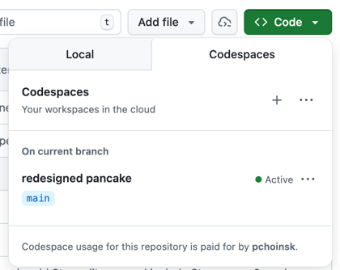
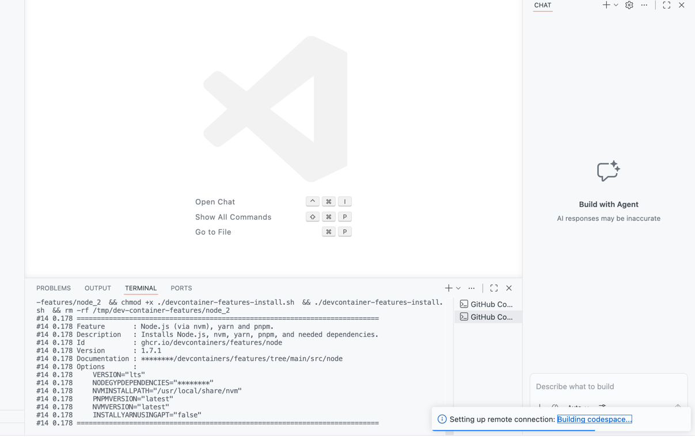
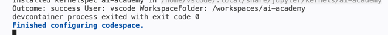
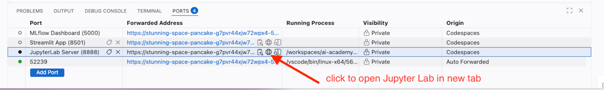

# 🎓 AI Academy - Learning Environment   

This repository is equipped with a custom-built Linux environment (Debian-based) containing 
all the tools you need for Python and Machine Learning exercises.
Check out the [AI Academy - Devcontainer Setup
](.devcontainer/README.md) for details on environment setup.

---

## 🚀 1. Launching your environment

**GitHub Codespaces** is recommended for the most consistent experience.

1. Navigate to the main page of this repository on GitHub.
1. Click the green **[<> Code]** button.
1. Select the **Codespaces** tab.
1. Click **Create codespace on main**.  

---

## ⏳ 2. Important: wait for setup!

This environment uses a base Debian image. This means VS Code will open almost immediately, 
but **the tools are still being installed in the background.** This may take 10-20 minutes on first launch. 

> NOTE:
> It's possible to create prebuilds which would make setup faster. 
> See [GitHub's documentation on prebuilds](https://docs.github.com/en/codespaces/prebuilding-your-codespaces/about-github-codespaces-prebuilds) for more details.  
> 
> If JupyterLab is not needed (since VSCode can run notebooks as well), then we can simply use Python devcontainer image
> with uv feature added which will make setup much faster.  
> 
> Another alternative is to use Python image and install JupyterLab in setup script and then run it using commandline. 

### How to know it is ready:
1. Click the green **[<> Code]** button.
1. Select the **Codespaces** tab.
1. Click on three dots next to your active codespace and select **"Open in Browser**.
1. Look at the bottom right of the window. You will see a small notification saying "Setting up Dev Container" 
or "Building Codespace".  

1. Click on **Building Codespace** or **Show Logs** to see the progress.
1. **Wait** until you see the message: `Finished configuring codespace` in the terminal logs.  



> [!CAUTION]
> If you try to run code or open a notebook before the setup is finished, you will see "Module Not Found" or "Kernel Not Found" errors. 
---

## 💻 3. Accessing the UI

### Option A: VS Code (Browser UI)

1.  Go to your [GitHub Codespaces Dashboard](https://github.com/codespaces). or click the green **[<> Code]** button on the repository page and 
select the **Codespaces** tab.
1. Find your codespace.
1. Click the **"..." (three dots)** and select **Open in Browser**.


### Option B: JupyterLab
Jupyter Lab is automatically started in the background when the Codespace is ready. To access it either click the 
notification that appears when it starts or find the URL in the "Ports" tab in the bottom panel of the Codespace. 
Look for the port `8888` which is used by JupyterLab and click "Open in Browser".


---

## ⚙️ 4. Selecting the right kernel

When you open a `.ipynb` (Notebook) file, you must ensure you are using the project's virtual environment.

1.  Look at the **top right corner** of the notebook editor.
2.  If it says "Select Kernel" or shows a different Python version, click it.
3.  Select **AI Academy (uv)** from the list.

---

## LLM models
It uses GitHub Models out of the box. If we want to use other models we can store API keys securely in GitHub Secrets.

## 🛠 Troubleshooting

### Missing Packages?
If a package is missing, use the `uv` command in the terminal:
```bash
uv add <package-name>